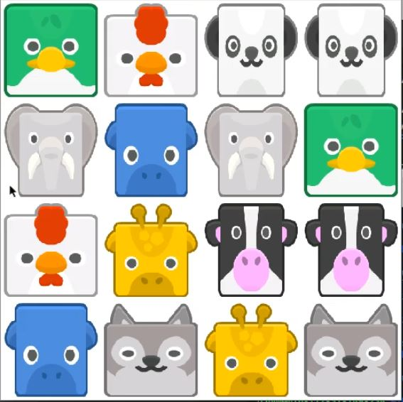

# Find the pair game

Small game built in python with pygame library. You only need to have pygame installed via pip and you can play.
Just find the pair animal as you select different squares.
 
 

 
Have fun playing!